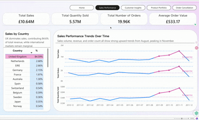
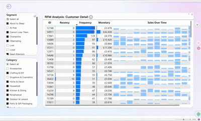

# PowerBI Portfolio

Welcome to my **PowerBI Portfolio**! 👏👏👏
This repository showcases and organizes my PowerBI visualizations. Each project includes a detailed analysis, data processing methods, and a direct link to the PowerBI report. 

I am continuously updating this portfolio with new projects and tutorials, so stay tuned!

---

## Projects

### 1. Online Retail Sales Visualization (Completed)
- **Description:** A visualization of online retail sales data. The dataset was analyzed using Python before being visualized in PowerBI.  
- [Click here to view project files](./projects/01-online-sales) 
- **Demo:**  
 
 
 
  

---

### 2. Public Company 5-Year Financial Analysis (In Progress)
- **Description:** An ongoing project analyzing five years of financial data of a public company. Insights and PowerBI visualizations will be added once completed.

---

Your feedback and continued interest are highly welcome!

---
