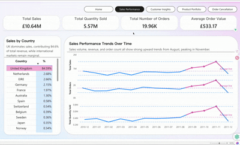
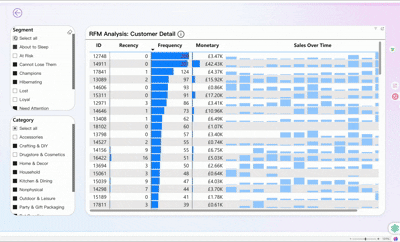
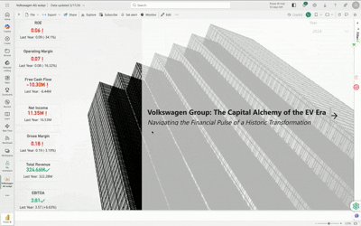
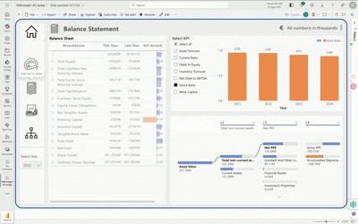
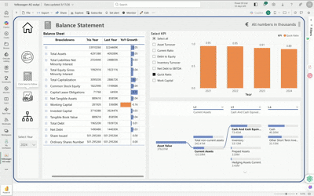

# PowerBI Portfolio

Welcome to my **PowerBI Portfolio**! 👏👏👏

This repository showcases and organizes my PowerBI visualizations. Each project includes a detailed analysis, data processing methods, and a direct link to the PowerBI report. 

I am continuously updating this portfolio with new projects and tutorials, so stay tuned!

---

## Projects

### 1. Online Retail Sales Visualization (Completed)
- **Description:** A visualization of online retail sales data. The dataset was analyzed using Python before being visualized in PowerBI.  
- [Click here to view project files](./projects/01-online-sales) 
- **Demo:**  
 
 
 
  

---

### 2. Public Company 5-Year Financial Analysis (Completed)
- **Description:** An project analyzing five years of financial data of a public company. The dataset was Power Query using Python before being visualized in PowerBI.
- - [Click here to view project files](./projects/02-Financial-data) 
- **Demo:**  
 
 
 
 
---
### 3. E-commerce App Transactional Data Analysis (Completed)
- **Description:** This project conducts in-depth e-commerce business and customer consumer behavior analysis based on real transactional datasets. Raw data is processed and cleaned by SQL, then visualized and explored via interactive Power BI dashboard. 
- - [Click here to view project files](./projects/03-E-commerce%20App%20Transactional%20Data/) 
- **Demo:**  
[Watch Demo Video](From Click to Cart.mp4)

---

Your feedback and continued interest are highly welcome!

---
